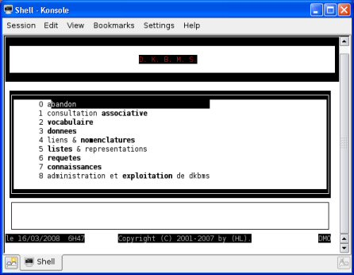
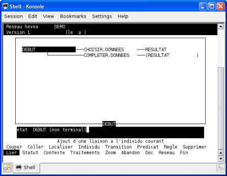
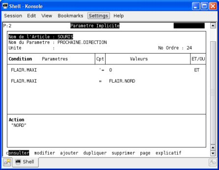
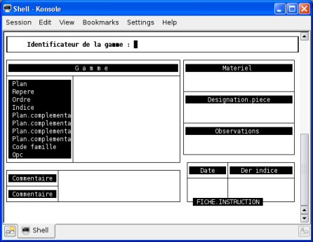

**Français** - [English](../en/README.md) - [中文](../zh/README.md) - [Espagnol](../sp/README.md) - [日本ais](../ja/README.md)

[README](./README.md) > [Documentations](./accueil.md) > **Présentation de YRExpert**

# Présentation de YRExpert

Un système expert est un système informatique capable de reproduire les raisonnements d’un expert dans un domaine bien défini. Un système expert est alimenté par des faits ou données explicites, il les traite et en tire d’autres faits qui aboutiront après des étapes successives à une conclusion :
- Un médecin écoute et examine son patient puis fait un diagnostic ;
- Un garagiste vous écoute et examine la voiture puis il en déduit ce qui ne marche pas dans votre voiture.

Ce sont deux experts qui font des diagnostiques. Ces spécialistes proposent des solutions aux problèmes que vous leur avez posés.

Si on analyse la manière dont un spécialiste pratique, on s’aperçoit que partant de faits, ils élaborent des enchainements de raisonnement que l’on peut mettre sous la forme :
- Si la pré-condition est satisfaite alors exécuter une action.

Comme tous les systèmes experts YRExpert se présente comme une coquille vide qu’il va falloir compléter.

YRExpert est un Système Expert libre fonctionnant sous Mumps GT.M et GNU/Linux.

## 1. Présentation
Base de données et de connaissances DKBMS

Evaluateur interactif HEVEA

TOTEM

MOZART

### 1.1. Historique

YRExpert n’a pas toujours été un projet de développement libre. L’origine de ce logiciel remonte aux années 80, le produit fut commercialisé jusqu’en 1995. L’outil fonctionnait sur des plateformes Unix ou PC sous VMS, VAX ou DTM donc sur des systèmes propriétaires...

Après le décès de son inventeur le projet n’a pas pu trouver de repreneur et sans développeurs pour lui faire passer l’an 2000 et l’euro les derniers utilisateurs ont du se résigner à migrer leurs données sur d’autres produits. Il m’a semblé utile de faire renaître ce génial logiciel dans le monde du logiciel libre : YRExpert fonctionne aujourd’hui sur l’environnement de programmation GT.M et le système d’exploitation GNU/Linux.

### 1.2. Utilisateurs

De grandes entreprises ont utilisé ce système expert. La plupart d’entre eux n’en avaient pas conscience. Elles utilisaient simplement un outil de données techniques.

## 2. Fonctionnement

YRExpert est un système expert complet. Il est composé des modules suivants :
- DKBMS - base de données et de connaissances
- GDX - gestion documentaire
- HEVEA - évaluateur interactif
- TOTEM - moteur d’inférence
- LINK - configurateur
- MOZART - éditeur de gamme
- EQX - aide à l’équilibrage de ligne

Ces modules sont en relation. Toute modification à quelque niveau que ce soit est répercutée vers tous les modules concernés.

Une partition complète contenant l’ensemble des données et connaissances relatif à un même système constitue une poche de connaissances. Des passerelles existent pour permettre de faciliter les échanges avec d’autres logiciels. Des savoirs-faire orientés métiers (mécanique, économie, ...), mais aussi des utilitaires de captures de données à partir de capteurs ou autres sources de données.

### 2.1. DKBMS - base de données et de connaissances

Ce module permet la gestionnaire de base de données et de connaissances, il comprend un environnement performant et tous les outils ou applications nécessaires.
On trouvera :

- La consultation associative qui est un véritable assistant pour la consultation de la base de données ; Vous pourrez interroger la base de donnée sans connaitre sa structure les recherches se faisant par le contenu.

- Le vocabulaire est très important pour un système expert, YRExpert gère un lexique valable dans tous les modules pour toute l’application ; Une gestion des synonymes est possible, elle est réalisable aussi bien sur les individus que sur les valeurs.

- Les données sont gérées dans une base relationnelle originale. Un schéma de données permet de définir la structure des données. Les données sont organisées en répertoires contenant des individus décrits par des attributs qui peuvent être multivalués (c’est à dire qui peuvent contenir plusieurs valeurs).

- Les liens et les nomenclatures sont gérés à l’aide de l’éditeur GDL. Cette éditeur permet la gestion directe et la visualisation des liens de structure ( de type Nomenclature). Une spécificité d’YRExpert est la gestion de trois types de liens différents. On trouvera des liens relationnels, hiérarchie et involutif c’est à dire qu’ils peuvent interagir avec les individus d’un même répertoire.

- Les listes et les représentations sont aussi possibles. Ces représentations d’individus sont synthétiques et peuvent prendre les formes suivantes : listes, états, graphiques.

- Les requêtes sont incontournables pour extraire des informations de la base de données de DKBMS, le principe est simple : une sélection d’individus est proposée selon les attributs de l’individu ou ceux qui y sont liés.

- La base de connaissances représente le stockage du savoir-faire, un module de Traitements, d’aide à la mise au point et un accès aux évaluateurs permettent une gestion de cet ensemble de règles.

- L’administration et l’exploitation de DKBMS sont assurées par plusieurs fonctions pratiques de vérification, de transformation et transfert de données.

### 2.2. GDX - gestion documentaire

Un module de Gestion du Savoir-Faire orienté sur la rédaction des documents industriels est aussi intégré à YRExpert. Son principe de fonctionnement est le suivant :

- D’abord, il faut créer les formats de documents qui correspondent à des fonds de pages.

- Ensuite, les informations issues de la base de données pourront être transcrites sur ces formats par l’intermédiaire de modèles de texte.

- L’édition de documents directement vers une imprimante est possible mais nécessite le développement d’une interface pour votre imprimante.

GDX permet aussi de gérer :
- Les termes équivalents - Gestion des termes équivalents.
- Le savoir-dessiner - Accès au Savoir-Dessiner.
- L’accès a DKBMS - Accès a la base de données DKBMS.
- L’impression du calendrier - Impression d’un calendrier semainier.

### 2.3. HEVEA - évaluateur interactif

La gestion et l’activation des réseaux sémantiques est simple. Le module HEVEA vous permet la création, la modification, la duplication ou la suppression des réseaux sémantiques.

Avant leur utilisation une compréhension est nécessaire. A cette étape on vérifie les erreurs de construction ou de syntaxe. Cette vérification de la validité du réseau permettra la construction d’une version exécutable.

Il suffit alors l’activation d’une étude pour utiliser YRExpert. L’activation d’un réseau HEVEA est équivalent à lancer un programme.

Dans tout les processus empruntés par YRExpert pour résoudre un problème, une étape importante est la phase de récupération des données et de diagnostique. Vous pouvez accéder à des saisies interactives qui sont une manière de communiquer avec le système.

Il est important de comprendre de cheminement du raisonnement qui a abouti à une conclusion. La consultations des historiques d’exécutions vous permettent ce suivi : Cela se traduit par une aide a l’explication des affectations, créations, ... Ceux sont les journaux qui vous donneront les explications.

### 2.4. TOTEM - moteur d’inférence

Le cœur d’YRExpert est le moteur d’inférence TOTEM. Ce module vous permet le définition des objets et l’écriture des règles du Savoir-Faire. C’est ce que l’on appelle l’apprentissage du savoir-faire.

Pour l’utilisation de ce savoir-faire une compréhension est nécessaire. Les règles sont mise en ordre en vue de leur mise en application ; Chaque fiche est interprétée et la cohérence vérifiée.

Pour mettre en application un objet du savoir-faire préalablement écrit une étude doit être lancée.

Il est possible de suivre le raisonnement suivi en analysant le résultats des études ; Une étude correspond aux explications du raisonnement suivi.

Les résultats des études sont automatiquement archivées. Une option permet de supprimer les études obsolètes.

La validation du savoir-faire va permettre la vérification, la reconstruction et recompréhension des règles du Savoir-Faire.

Un certain nombre d’autres manipulations sont possibles :
- La sauvegarde de savoir-faire TOTEM sous forme de fichier ;
- La restauration de savoir-faire archive sous forme de fichier ;
- La consultation, modification et suppression de méta-règles.

### 2.5. LINK - configurateur

Ce module est spécifiquement destiné au service des méthodes. LINK permet la génération automatique de nomenclature. Ce configurateur gère de manière très simple les caractéristiques des articles.

Pour le service méthodes, la gestion des nomenclatures articles et des gammes de fabrication permettent de définir les composants de vos articles ainsi que les process liés à l’obtention de votre produit fini.

### 2.6. MOZART - éditeur de gamme

Ce module est aussi spécifiquement destiné au service des méthodes. MOZART permet la création, la modification et la suppression de gammes de fabrication.

Les autres options possibles sont :
- Le gestion des machines ;
- La gestion des outils ;
- La description du vocabulaire des gammes ;
- La gestion des actions, des manières et des objets.

MOZART contient aussi :
- Un savoir pour aider à la rédaction d’une gamme ;
- Une gestion des visas ;
- Une gestion du lexique ;
- Un outil de transfert de gammes.

### 2.7. EQX - aide à l’équilibrage de ligne

Comme LINK ou MOZART, ce module est aussi spécifiquement destiné au service des méthodes. EQX permet une aide à l’équilibrage de ligne. On trouve les options suivantes :
- La création, la modification et la suppression d’études ;
- Un accès aux traitements ;
- La gestion des inséparables ;
- La gestion des incompatibles ;
- L’activation des études
- L’impression des études

## 3. Les extensions des fichiers

Les données comme tous les autres objets d’YRExpert sont archivées dans un fichier au format texte. La structure des informations dans ce fichier est très importante, c’est pour cette raison qu’il contient toujours en entête la version de l’outil de sauvegarde et restauration.

Dans plusieurs cas la structure de sauvegarde sera liée directement à la structure de sauvegarde de la base de données que l’on utilise. Dans notre cas ce sera GT.M !

Malgré que cela ne soit pas obligatoire, on conseille de réserver une extension pour chaque type de données. On retrouve :

- .ARC , pour les traitements, les modèles, les formats et les requêtes ;
- .IND , pour les individus d’un répertoires ;
- .PAS , pour les passerelles ;
- .GBL , pour fiches de TOTEM ;
- etc.

Lors de certaines sauvegardes d’YRExpert des fichiers et format vous seront proposés.

## 4. Produits associés

Un certain nombre de modules complémentaires peuvent s’interfacer avec YRExpert.

## 5. Références

Coordonnées de l’éditeur :
Yrelay
Hamid LOUAKED
10, impasse Faraday
78520 LIMAY
e-mail : Hamid

## 6. Voir aussi

Les générateurs de systèmes experts et les machines sont :

Les pionniers :
- EMYCIN
- KAS
- HEARSY-III
- EXPERT
- AGE
- CADUCEUS
- RLL
- INTERNIST/CADUCEUS
- DENDRAL

Les gros systèmes :
- ART
- KEE
- KES
- KNOWLEDGE CRAFT

Systèmes pou micros et systèmes récents :
- ARGUMENT-DECIDEX
- FIRST-CLASS
- GURU
- INTELLIGENCE SERVICE
- M1
- NEXPERT-OBJECT
- PERSONAL CONSULTANT PLUS
- SMECI
- VP-EXPERT

### 6.1. Liens internes
- Télécharger YRExpert
- La SOURIS et le FROMAGE
- Documentation utilisateur d’YRExpert
- Liens : Intelligence Artificielle (IA) et Systèmes Experts
- Annuaire des Générateurs de systèmes experts et les Machines dédiées

### 6.2. Liens externes
- Système expert - Wikipedia
- [YDB](https://github.com/YottaDB/YDB)
- [NodeM](https://github.com/dlwicksell/nodem)
- [VistA](https://github.com/WorldVistA)
- [Rob Tweed](https://github.com/robtweed)

