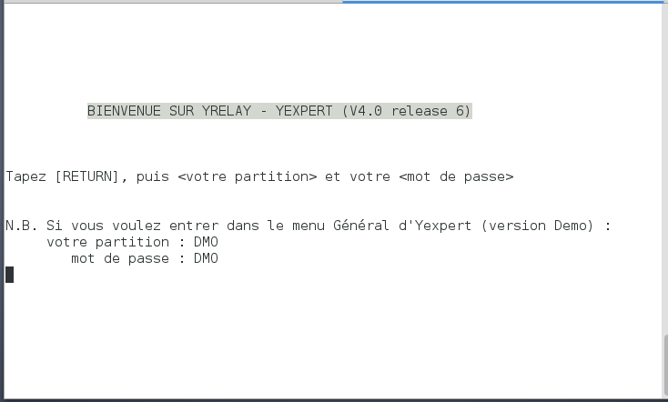

[English](../en/README.md) - [Français](../fr/README.md) - [Español](../es/README.md) - [Deutsch](../de/README.md) - [中文](../zh/README.md) - [日本語](../ja/README.md)

[README](./README.md) > [Documentations](./accueil.md) > **Premiers pas avec YRExpert**


# Premiers pas avec YRExpert

Si vous venez de mettre en place une instance de `yrexpert` et souhaitez commencer à l'utiliser, vous êtes au bon endroit.

Vous avez probablement constaté que l'installation peut se faire de deux manières distinctes :
* En local sur un système Linux de type Debian
* Dans une machine virtuelle (VM) VirtualBox en optant pour Vagrant

Si vous n'avez pas encore effectué cette installation, veuillez suivre ce lien : [Mise en place d'une instance de YRExpert](./construireUneInstance.md)

## 1. Accéder à YRExpert

L'accès à `yrexpert` se fait via le protocole SSH. Si vous avez opté pour Vagrant, la VM a déjà mis en place ce protocole et ouvert les ports correspondants sur VirtualBox.

* 22 - SSH pour le cloud ou pour une utilisation locale
* 50022 - SSH pour la VirtualBox

Si vous utilisez un fournisseur de cloud (AWS/EC2, Rackspace) :
* Vous devrez préalablement ouvrir le pare-feu du cloud pour les ports susmentionnés avant de démarrer le processus.
* Pour connaître facilement l'adresse IP, il suffit de consulter votre adresse DNS dans le portail de gestion de votre fournisseur de cloud.

Les codes d'accès/identification sont les mêmes que ceux utilisés pour les tests automatisés.

Il est également possible d'accéder à la machine virtuelle en utilisant un autre programme SSH (comme PuTTY pour Windows). Il vous suffira d'entrer l'adresse comme décrit ci-dessus, en utilisant le port 22 pour les installations cloud et 50022 pour une installation locale de VirtualBox.

## 2. Accéder en mode terminal

* Si vous avez choisi Vagrant, vous devez démarrer votre VM VirtualBox :

````shell
$ cd ~/yrelay/yrexpert-box/debian
$ vagrant up
````
* Si vous avez opté pour le cloud ou pour une installation locale : aucune action n'est requise.

Deux comptes utilisateurs sont automatiquement créés lors du processus d'installation pour faciliter l'accès à `yrexpert` :

>Note : par défaut `${instance}` est `yrexpert`.

Compte utilisateur :
* Nom d'utilisateur : ${instance}util
* Mot de passe : util

Compte programmeur :
* Nom d'utilisateur : ${instance}prog
* Mot de passe : prog

${instance}util donne accès à YRExpert en mode terminal. Au démarrage, cet utilisateur exécutera automatiquement la routine `^VSTART`.

Pour vous connecter en tant qu'utilisateur avec l'instance `yrexpert` par défaut :

````shell
$ ssh -p 50022 yrexpertutil@localhost # sur VM
````

ou,

````shell
$ ssh -p 22 yrexpertutil@localhost # en local
````

Ensuite, saisissez le mot de passe.


Partition DMO :
* Votre partition : DMO
* Mot de passe : DMO



`${instance}prog` correspond au programmeur qui accède à l'invite de commande M. Ceci est équivalent à la ligne de commande : `$ mumps -dir`

Pour vous connecter en tant que programmeur à l'instance `yrexpert` par défaut :

````shell
$ ssh -p 50022 yrexpertprog@localhost # sur VM
````

ou,

````shell
$ ssh -p 22 yrexpertprog@localhost # en local
````

Ensuite, saisissez le mot de passe.

Pour vous connecter en tant qu'utilisateur Linux (avec privilèges sudo) :

````shell
$ cd ~/yrelay/yrexpert/scripts/install/debian
$ vagrant ssh
````

Vous pouvez désormais utiliser le système comme une autre instance de Linux. Si vous devez accéder à l'environnement M de yrexpert, exécutez la commande suivante :

````shell
$ vagrant@yrexpert:~$ mumps -dir
````

Cela ouvrira une invite de programmeur. Pour accéder à l'écran de connexion YRExpert standard, entrez la commande suivante :

````
YXP> D ^VSTART
````

L'invite `YXP>` indique que vous êtes sur la partition programme de `yrexpert`. Pour naviguer entre les partitions, par exemple pour vous déplacer vers la partition `DMO`, vous devez entrer `w $$ZGBLDIR^%GTM("DMO")`

Pour accéder aux fichiers via SFTP, connectez-vous en tant qu'utilisateur `vagrant` ou avec le compte pré-créé si vous utilisez un fournisseur de cloud (EC2/Rackspace).

## 3. Arrêt de la VM Vagrant

Pour arrêter l'instance `yrexpert`, entrez `vagrant halt` ou `vagrant suspend` :

* `vagrant halt` permet d'arrêter la VM et l'OS invité. Pour reprendre l'utilisation de la VM, entrez `vagrant up` pour la redémarrer.

* `vagrant suspend` met la VM en "pause" - la mémoire et l'état d'exécution sur le disque seront sauvegardés. Cette option est utile lorsque vous souhaitez sauvegarder votre progression et y revenir rapidement ultérieurement. Pour reprendre l'utilisation de la VM, entrez `vagrant resume`.

## 4. Intégration de EWD.js 

EWD.js est installé par défaut lors de l'exécution de `vagrant up`. Une version française de la documentation et des liens associés est disponible sur le dépôt [yrexpert-Documents](https://github.com/yrelay/yrexpert-Documents/raw/master/Ewd/EWD3_fr.pdf). Les paramètres de configuration essentiels sont listés ci-dessous :

Mot de passe :

* EWDMonitor : keepThisSecret!

Ports :

* yrexpert-js   --> localhost:50080 (http)
* yrexpert-term --> localhost:50081 (http)
* yrexpert-rpc  --> localhost:50082 (http)

Services :

* ${instance}yrexpert : gestion des processus M
* ${instance}yrexpert

-js : contrôle de yrexpert-js, yrexpert-term et yrexpert-rpc

Pour contrôler le type de service :

````shell
$ sudo service ${instance}yrexpert-js {start,stop,restart}
````

Où ${instance} est le nom de l'instance et {start,stop,restart} est la fonction que vous souhaitez exécuter.

Les fichiers de logs pour ${instance}yrexpert et ${instance}yrexpert-js sont localisés dans `/home/$instance/log/` :

* `recupererJournal.log`
* `reduireJournal.log`
* `ewd-xpress-gtmErr.log`
* `ewd-xpress-gtmOut.log`
* `yrexpert-termErr.log`
* `yrexpert-termOut.log`
* `yrexpertrpcOut.log`
* `yrexpertrpcErr.log`

Pour accéder à l'administration du serveur EWD.js, entrez le lien suivant dans l'URL de votre navigateur : **http://localhost:50080/yrexpert/index.html**

## 5. Quelques erreurs courantes

### 5.1. Problème de connexion SSH

Chaque nouvelle VM Vagrant crée une nouvelle clé de machine SSH, qui possède une nouvelle empreinte digitale. Certains clients SSH peuvent refuser cette situation et vous empêcher de vous connecter. Le message d'erreur donne généralement des instructions pour résoudre ce problème de connexion. Par exemple, pour Debian, entrez :

````shell
$ ssh-keygen -f "/home/user/.ssh/known_hosts" -R [localhost]:50022
````

### 5.2. %GTM-E-REQRUNDOWN

>%GTM-E-REQRUNDOWN, Error accessing database /home/yrexpert/globals/temp.dat.  Must
> be rundown on cluster node srv10.,%GTM-I-TEXT, Error with database control sema
>phore (IPC_STAT),%SYSTEM-E-ENO43, Identifier removed
>		At M source location NETJOB+2^%SGNETMZ

Pour corriger cette erreur, vous devez exécuter un programme Linux nommé mupip, qui fait partie de GT.M :

````shell
$ sudo su "yrexpert" -c 'source /home/yrexpert/config/env && $gtm_dist/mupip rundown -r "*"'
````

### 5.3. Connection to localhost closed

Si vous rencontrez une erreur "Connection to localhost closed" lors de la connexion - Votre partition : DMO. Vous devez exécuter un programme Linux nommé mupip, qui fait partie de GT.M :

````shell
$ sudo su "yrexpert" -c 'source /home/yrexpert/config/env && $gtm_dist/mupip rundown -r "*"'
$ sudo su "yrexpert" -c 'source /home/yrexpert/partitions/dmo/config/env && $gtm_dist/mupip rundown -r "*"'
````

>Note : dans certains cas, vous devrez redémarrer les services avant d'effectuer la réparation.
